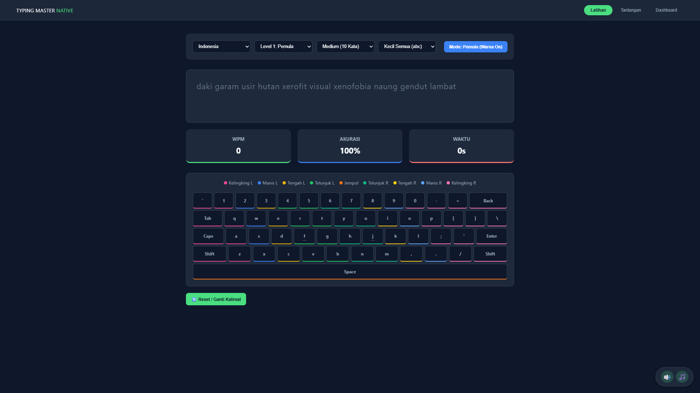
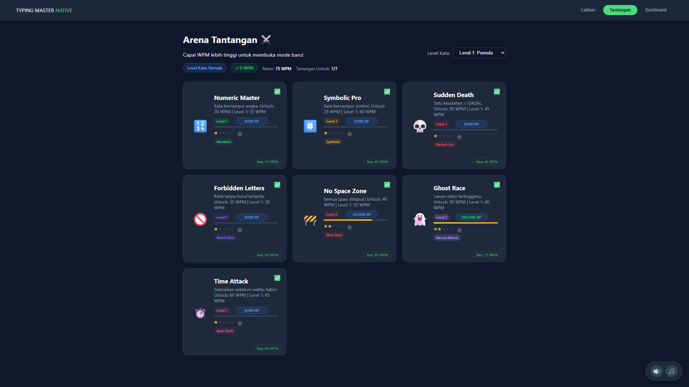
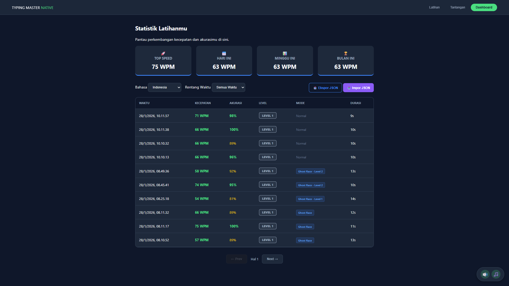

# TypingMaster Native Pro

TypingMaster Native Pro adalah aplikasi **latihan mengetik berbasis web** yang dirancang untuk meningkatkan kecepatan (WPM), akurasi, dan konsistensi mengetik dengan berbagai **mode latihan dan tantangan**. Aplikasi ini berjalan **tanpa backend**, sepenuhnya menggunakan **HTML, CSS, dan JavaScript (Vanilla)**.

| Screenshot 1 | Screenshot 2 | Screenshot 3 |
|--------------|--------------|--------------|
|  |  |  |

---

## 🚀 Fitur Utama

### 🎯 Latihan Mengetik
- Pilihan **bahasa**: Indonesia & English
- **Level kesulitan** (Pemula → Legenda)
- Panjang teks:
  - Pendek (5 kata)
  - Medium (10 kata)
  - Panjang (15 kata)
- Mode huruf:
  - Huruf kecil
  - HURUF BESAR
  - Campuran

### ⌨️ Keyboard Interaktif
- Visual keyboard real-time
- Warna jari (finger placement)
- Indikator tombol aktif
- Mode **Pro** (tanpa warna)

### 📊 Statistik Real-Time
- WPM (Words Per Minute)
- Akurasi (%)
- Waktu mengetik

### ⚔️ Mode Tantangan (Unlock Berdasarkan WPM)
- **Numeric Master** – kata + angka
- **Symbolic Pro** – kata + simbol
- **Sudden Death** – satu salah = gagal
- **No Space Mode** - tanpa space
- **Exclude Letter Mode** - hilangkan huruf
- **Ghost Race** – lawan hasil sebelumnya
- **Time Attack** – batas waktu

### 🧠 Dashboard
- Riwayat latihan
- Data disimpan menggunakan **IndexedDB**
- Statistik performa pengguna

---

## 🗂️ Struktur Folder
    ├── index.html          # Halaman utama aplikasi
    ├── style.css           # Styling & UI komponen
    ├── script.js           # Logika aplikasi & engine mengetik
    ├── words.json          # Bank kata (ID & EN, multi level)
    ├── music # Folder musik
      ├── click.mp3           # Efek suara ketikan benar
      ├── error.mp3           # Efek suara ketikan salah
      └── bg-music.mp3        # Musik latar belakang (opsional)
    └── README.md           # Dokumentasi

---

## 🧩 Teknologi yang Digunakan

- HTML5
- CSS3 (Custom UI, Dark Theme)
- JavaScript (Vanilla JS)
- IndexedDB (penyimpanan lokal)

---

## ▶️ Cara Menjalankan

1. Download / clone repository ini
2. Pastikan semua file berada dalam **satu folder**
3. Buka `index.html` menggunakan browser modern (Chrome / Edge / Firefox)
4. Tidak memerlukan server atau koneksi internet

---

## 📌 Catatan Penting

- Pastikan file `words.json` tidak terhapus
- Data latihan tersimpan **lokal di browser**
- Jika cache bermasalah, gunakan **Incognito Mode**

---

## 👤 Author

Dikembangkan oleh **Chandra**  
Project latihan & eksplorasi JavaScript Front-End.

---

🔥 *Latihan konsisten lebih penting dari kecepatan instan.*
